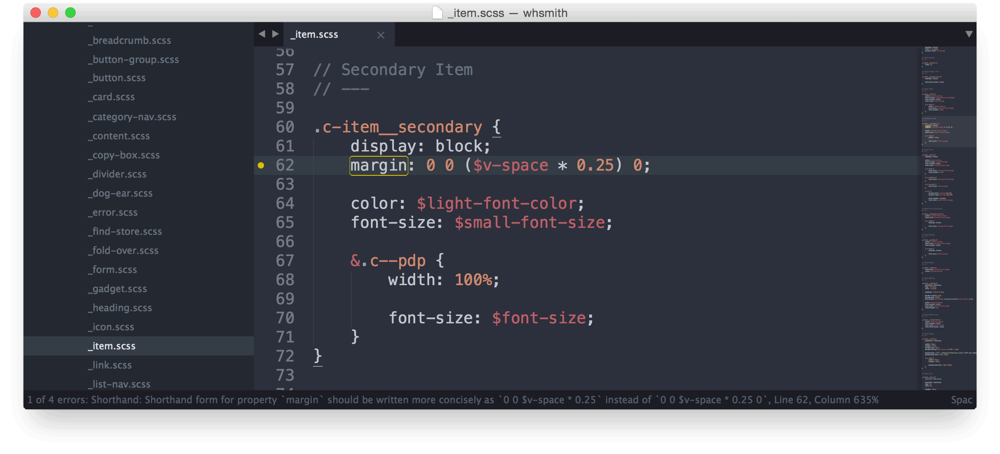

# Thoughts on CSS and Preprocessors (or: How I Learned to Stop Worrying and Love the Cascade)

When I started at Mobify in 2012, I had only a passing acquaintance with preprocessors. I had barely used Sass. But I did have some opinions on &ldquo;the right way to write CSS.&rdquo; Mobify hired me because I was a designer with front-end development skills. I needed to get caught up on the Mobify way of writing SCSS as quickly as possible. What I found at the beginning sent me way further than the prescribed four levels deep.

## In the Beginning

Mobify is in the unusual business of making modern mobile and tablet sites on top of an existing desktop site. Without making any changes to the existing site, we can layer Javascript and CSS to produce a site the looks and behaves completely differently.

> We can take any site and make it beautiful and functional. No matter what its markup looks like.

It&rsquo;s akin to scraping a site for content, but it runs entirely in Javascript on the front-end: it shuffles elements around; deletes elements that are unnecessary; and adds new markup, scripts, and assets. However, each of these transformations delays the initial page load, so we have to be judicious with our changes.

On top of that, we faced the same problems many teams hit with CSS. Our selectors were often extremely specialized ostensibly to prevent conflicts. Little code was reusable between projects or even within the same project. Incremental work to projects often only added CSS, rarely refactoring it to be smaller and more general.

We also had problems of our own making. We overused Sass&rsquo;s extend and include to apply consistent styles to disparate markup leading to bloated stylesheets. We relied on markup from the existing site that was liable to change underfoot. Sites were often built template-by-template, and our CSS began to reflect our project management process, with different templates implemented by different people in different ways.

Our problem was also one of scale. We had dozens of different projects&mdash;under active work or occasional maintenance&mdash;each with built on top of a completely different desktop site. We needed to adopt practices, tools, and components that would help us unify the differences between them allowing our team to leverage what they know on one project on another.

Each of these problems were bad on their own. Together, they compounded into something that was easily becoming a maintenance nightmare. It was hard for new designers and developers to get ramped up on old projects. As we added more people to the team, the way we wrote our CSS started to drift from person to person, because there were no clear guidelines. Things needed to change.

## Back to the Present

Today, Mobify writes extremely [opinionated CSS](https://github.com/mobify/mobify-code-style/tree/master/css "Check out our style guide if you want a full overview") and uses SCSS functionality only where it adds value. Over the past two years, I worked to implement large changes to fix the above problems and turn writing CSS from something we just did to something that we did _very well_. To do that, I&rsquo;ve worked with the design team to come up with some guiding principles.

These guiding principles state that our code should:

1.  Look like the same person wrote it
2.  Be written in standard modern CSS as much as possible
3.  Be self-documenting
4.  Be reusable by default

Each of these principles were written to address the specific issues I outlined. They helped inform our re-architecture and made it easier for our developers to make decisions when they were looking to improve process, do code reviews, or contribute new code.

### Walk This Way

The goal behind enforcing _how_ we write CSS was to make it easy for developers to move between projects and provide new developers clear direction. We created a set of [formatting rules](https://github.com/mobify/mobify-code-style/tree/master/css/css-best-practices#format) as well as a specific order of [property declarations](https://github.com/mobify/mobify-code-style/tree/master/css/css-best-practices#declaration-order) that your CSS must follow. To make this easier on developers, we lightly enforce these rules using [SCSS Lint](https://github.com/causes/scss-lint).

> SCSS Lint lets people know when they&rsquo;re breaking the rules. Sometimes there&rsquo;s good reason.

Our CSS is now as easy to read as it is to maintain. Moving between projects is simple. It has the added benefit of making code reviews much simpler as we can focus on the actual problems with the code instead of spending time talking about formatting.

To add to this, we also started an open-source project, [Vellum](http://www.github.com/mobify/vellum), to give people a standard set of variable names and base styles that they can build off for their projects. Providing default variable names ensures that our projects generally refer to things the same way, so developers require very little time to ramp up and start writing CSS when they switch to a new project.

### Finding True North

We should strive to write modern standard CSS as much as possible. The spirit of this principle was really the desire to move away from depending on Sass as much as we did&mdash;and, really, that meant moving away from Compass entirely. To achieve this, we implemented a couple of changes to our build system.

The first was finding a replacement for prefixing. With Compass, we relied on mixins to generate the prefixes we needed. We should simply write CSS the way it&rsquo;s meant to be written, and our build step should automatically generate the prefixes for us. Luckily, [Autoprefixer](https://github.com/postcss/autoprefixer) does exactly this. It runs after Sass compiles and before we minify solving our prefixing problem in one move. It also gave us the added benefit of being able to specifically target the prefixes we need for the exact browsers we support.

Next, we needed to give developers access to the mixins that Compass provided that were actually useful. I did an audit of most of our sites and found the mixins and functions people were using most often like clearfixing or text replacement. I collected these in a new open source project called [Spline](http://www.github.com/mobify/spline). Since the creation of Spline, we&rsquo;ve been able to add new mixins and functions as well as think critically about how they&rsquo;re written. We can also tightly control the output to ensure it matches the rest of our guidelines.

Sass is still useful, and we didn&rsquo;t want to abandon it entirely. By switching to Autoprefixer and Spline, we can be very targeted with our Sass usage. We outlined [some core rules](https://github.com/mobify/mobify-code-style/tree/master/css/sass-best-practices#sass-scss-best-practices) behind how and when Sass should be used and left the rest to the tools. This put us in a very good position to move away from Sass entirely if necessary and allowed us to be ready for new updates whenever they come down the line.

### What&rsquo;s In a Name?

Code should be self-documenting. We still had to deal with our clients&rsquo; existing Javascript, so we definitely needed to prefix our class names. Instead of using `x-` for everything, we came up with prefixes that denoted what the class represented. As we were moving to a component-driven development process, we wanted to be able to discern between three things: Components, Templates, and Global modifiers.

We decided to prefix classes based on their function. Component classes all get prefixed with `c-`, Template classes all get prefixed with `t-`, and Global classes all get the old prefix `x-`.

We also decided to switch to a BEM-like syntax. I call this convention CSM for _Component, Sub-Component, Modifier_. If you&rsquo;re familiar with BEM, it will look very similar with some small changes. CSM uses the cascade more than standard BEM by using class chaining to attach modifiers to component and sub-component classes. For more insight into how CSM works, [this document](https://github.com/mobify/mobify-code-style/tree/master/css/class-naming-conventions#csm) outlines the process really well.

While these may seem like small changes, the benefit is huge. By looking at a single class in the inspector, developers immediately know exactly where that CSS lives and where they need to go to make a change. For instance, if you see a class called `c-card__title`, you know you need to look in the _components_ folder, and you need to look in the _card_ SCSS file for the _title_ subcomponent.

It also means we essentially never have to nest. Nesting only happens when we want to attach modifiers to a class or use a parent component to modify how a component acts. This reduces specificity greatly and goes a long way towards encouraging reusability.

### Think Globally, Fix Locally

Of all of the things that make an impact on our day to day development, writing reusable code is probably the most useful. It was also the one that required the biggest change in mindset&mdash;and buy in&mdash;from everyone involved on the projects. The idea was simple: everything we design, develop, and engineer for every project should be reusable.

In our CSS, this mostly manifested in one directive: write component-first, not template-first. Instead of assuming that something is only going to appear once and tying it to the template, we instead assume it is going to be used many times and in many ways. We should write in a way that is easily repeated, extended, and modified. This is where the CSM convention really starts to shine.

Breaking things down into components, subcomponents, and modifiers forces you to think about the thing you&rsquo;re writing bit by bit. Is this really another subcomponent? Have I written this subcomponent before? Could I use the _title_ component I wrote for that other thing for this? Critically thinking about our CSS as we write it has made it easy for us to create components that can be reused throughout the same project. That reusability makes it simple to abstract these components out and use them on other projects.

We call those reusable components Stencils. [Stencil](http://www.github.com/mobify/stencil) is an open source project we put together to start collecting all of the standard bits and pieces that make up the sites we build. As a team, we&rsquo;ll be able to write better code overall if we spend our time refining the things that we&rsquo;ve built already instead of building them over and over again. While Stencil is in its infancy, it&rsquo;s been widely adopted by the UI Development and Design teams at Mobify and is growing rapidly.

The short term benefit for our sites is that our CSS files get easier to maintain and are much smaller overall. We saw, on average, a 50% reduction in CSS file size when we moved to our component-driven development approach. The long term benefit is that we can spend more time making the unique parts of our site better instead of wasting time writing things we&rsquo;ve written before.

### How do you follow that?

We&rsquo;ve made a lot of improvements that have had a huge impact on how we write CSS. Overall, I think we&rsquo;ve done a good job of tackling the issues we used to have. But we&rsquo;re not done. We&rsquo;re considering some other ways we can improve:

1.  Using our component approach to create living styleguides for each of our sites
2.  Creating a company-wide visible library showing we&rsquo;ve implemented specific patterns to make it easy to share that experience with everyone
3.  Switching to libsass to make compiling our code faster
4.  Using tools to measure things like specificity increases or enforce performance budgets
5.  Adopting all sorts of other half-baked ideas

CSS is still a really young technology, and I think preprocessors have distracted us from some of the big problems. Especially when you think about writing CSS for enterprise. There&rsquo;s lots we&rsquo;ve done to make it better, but there&rsquo;s still a lot more that we all have to figure out.
