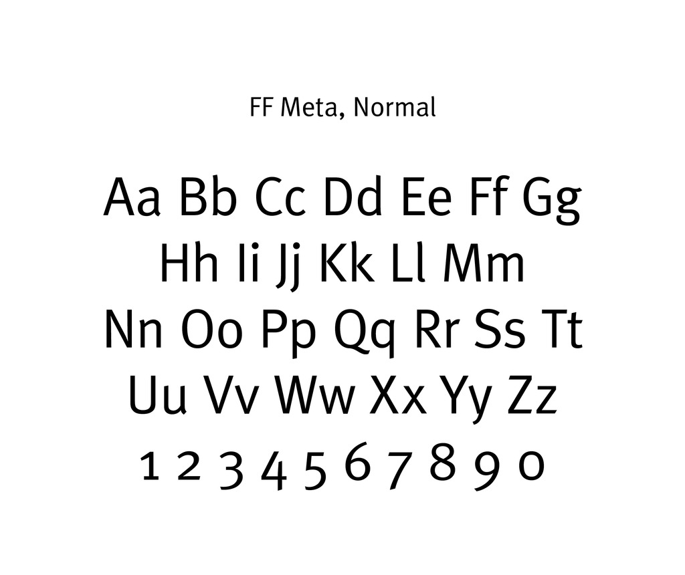
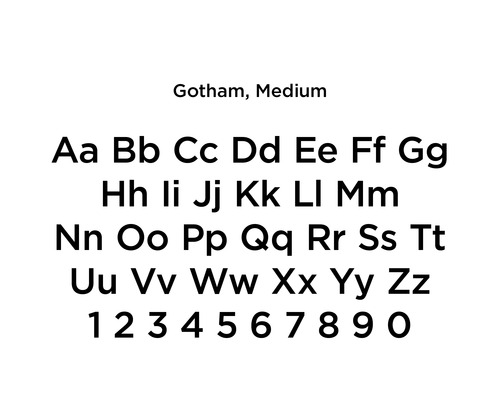
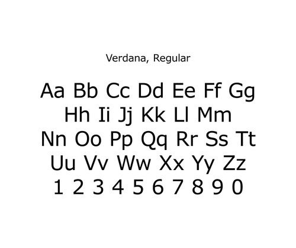
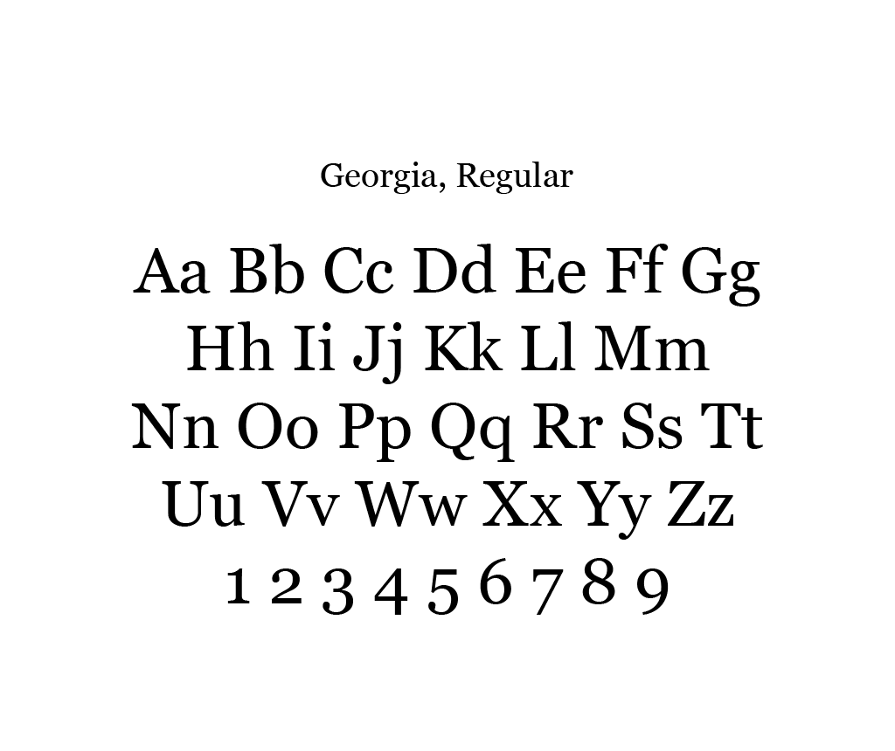
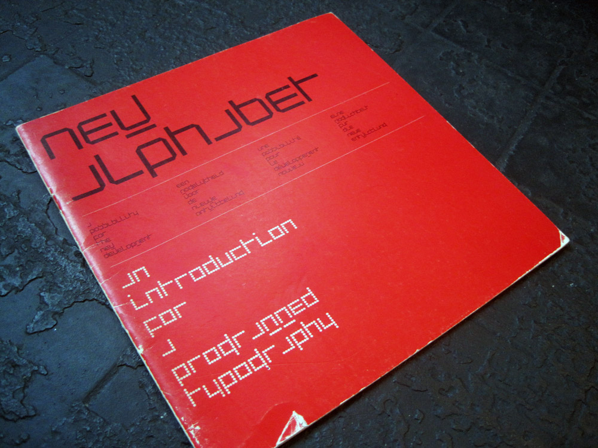
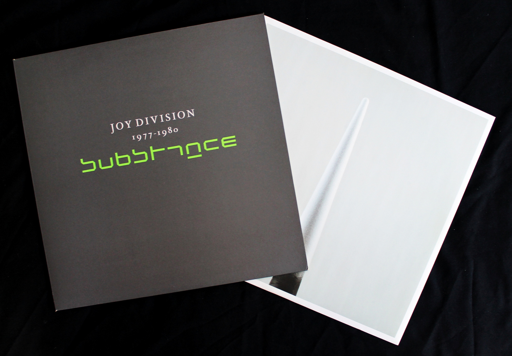

# Georgia as Art

Typefaces’ use as practical tools for communication hasn’t stopped them being repositioned as art. In 2011, twenty-three digital typefaces were inducted into the Museum of Modern Art’s Architecture and Design collection (Antonelli).

This included Tobias Frere-Jones’ Gotham (2000), prominently use by the Obama presidential campaign in 2008 and 2012, Erik Spiekermann’s FF Meta (1984-1991), and Matthew Carter’s popular screen typeface Verdana (1996).

Georgia (1996) was strangely omitted—“How can MoMA include Verdana without including Georgia?” Paul Shaw wondered (Shaw)—though this was perhaps due to the inclusion of six other Carter typefaces.

<figure class="figure--aside figure--border">

<figcaption>The MoMA’s specimens for Tobias Frere-Jones’ [Gotham](#), Erik Spiekermann’s [FF Meta](#), and Matthew Carter’s [Verdana](#). Lastly is an invention of how the Georgia specimen might have appeared.</figcaption>
</figure>

Less conventional selections were also made, like Zuzana Licko’s bitmap face Oakland (1985), her collaboration with P. Scott Makela for Dead History (1990), and FF Beowolf. Beowolf, designed in 1990 by Erik van Blokland and Just van Rossum, illustrated the potential for generated digital type and tools, when this was explored even less than today.

<figure class="figure--aside">

<iframe src="http://player.vimeo.com/video/49548029?badge=0" height="240" width="320"></iframe>

<figcaption>Today, Beowolf is distributed as multiple styles, but the original version is actually randomly generated (Letterror).</figcaption>
</figure>

<!-- Elaborate on Beowolf? -->

Even with this goal, Beowolf functions as a tool more than an idea or concept; to make its point, it had to be a useful, functioning typeface. In <cite>Conceptual Type?</cite>, type designer Peter Biľak quickly disparages the term:

> let’s be clear that conceptual type is an oxymoron. A typeface can’t really be conceptual, because it is dependent on its execution. … Before the typeface is executed, it is not a typeface, it is simply an idea”

> __Peter Biľak, [Conceptual Type?](https://www.typotheque.com/articles/conceptual_type)__

Biľak makes execution a requirement: it has to exist as usable type to be considered type. When this isn’t met, it’s less likely the work will be viewed as type. Type designer Wim Crouwel noted his MoMA inducted typeface New Alphabet (1967) was an experiment, not intended for extensive use (Kennedy). When a typeface’s concept overpowers its ability to be used, its applications are likely to remain conceptual.

<figure class="figure--aside">

<figcaption>Wim Crouwel’s New Alphabet, in use on the cover of his <cite>New Alphabet: An introduction for a programmed typography</cite> (1967). [Photo © Bas van Vuurde](https://www.flickr.com/photos/39774626@N03/6498809487)
</figcaption>
</figure>

<figure class="figure--aside">

<figcaption>Peter Saville modified New Alphabet, prioritising convention over its concept, before using it on the cover of the Joy Division collection, <cite>Substance</cite> (1988). [Photo © ceremony60](https://www.flickr.com/photos/56516867@N04/9161081906/in/photostream/)</figcaption>
</figure>

According to Erwin Panofsky, an object “either demands or does not demand to be experienced [aesthetically], for it has what the scholastics call _intention_” (12). A typeface’s nature as a tool and “vehicle of communication” (Panofsky 11) doesn’t demand it, but it does permit it. The work of type designers, like architects and industrial designers, “reflects social developments, advances in materials and means of production, cultural biases, and technological progress” (MoMA 348).

<!--
Design is frequently re-contextualised as art
Michael Beruit, [describe who he is], suggests this transition is acceptable when —it’s just less common with type.]
-->

The repositioning of typefaces like Georgia and its selected kin as a works, rather than an enabler of work, perhaps only highlights the increased awareness of type in the collective cultural consciousness: no longer is Helvetica Bold at 36pt. the only typeface at the MoMA.

## Works Cited

- Antonelli, Paola. “Digital Fonts: 23 New Faces in MoMA’s Collection.” <cite>InsideOut</cite>. The Museum of Modern Art, 24 Jan. 2011. Web. 15 Nov. 2014.
- Biľak, Peter. “Conceptual Type?” <cite>Typotheque: Conceptual Type? by Peter Biľak</cite>. Typotheque, 2011. Web. 11 Nov. 2014.
- Kennedy, Gabrielle. “Wim Crouwel on His 80th Birthday, Part II.” <cite>Wim Crouwel on His 80th Birthday</cite>. Design.nl, 2009. Web. 18 Nov. 2014.
- LettError. “FF Beowolf.” <cite>FontFOnt Beowolf | LettError</cite>. LettError, n.d. Web. 11 Nov. 2014.
- Museum of Modern Art, comp. <cite>MoMA Highlights: 350 Works from the Museum of Modern Art</cite>. New York: Museum of Modern Art, 2004. Print.
- Panofsky, Erwin. “The History of Art as a Humanistic Discipline.” <cite>Meaning in the Visual Arts</cite>. Chicago, IL: U of Chicago, 1982. 1-25. Print.
- Shaw, Paul. “Opinion-Standard Deviations.” <cite>Paul Shaw Letter Design</cite>. Paul Shaw, 23 Mar. 2011. Web. 18 Nov. 2014.